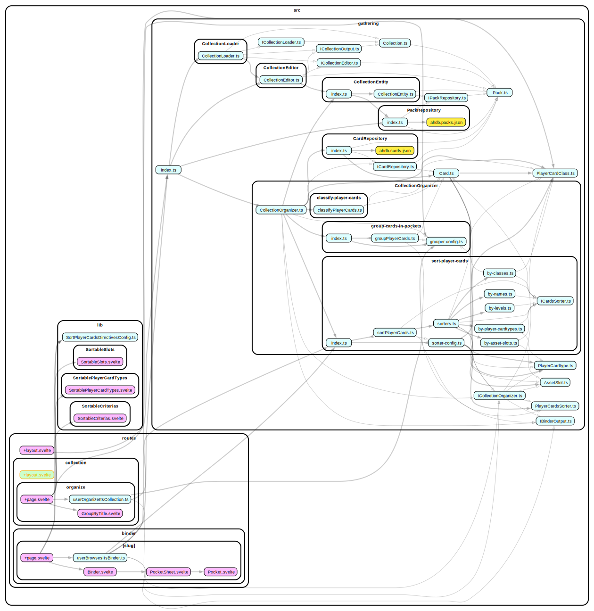

# The Gathering

A binder storage solution for Arkham Horror: The Card Game.

## Install

```bash
pnpm install
```

## Developing

Start a development server:

```bash
pnpm dev
```

## Architecture

To refresh dependency-graph.svg, linked below...

```bash
pnpm arch
```



## Building

To create a production version of your app:

```bash
pnpm clean && pnpm build && pnpm preview
```

## Deploying

Pushing to a remote branch deploys a preview. **Pushing/merging to main deploys to production.**

This is hosted @ Vercel: https://ahtcg-the-gathering.vercel.app/.
